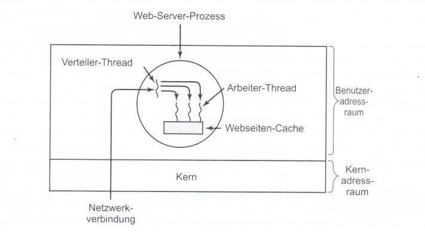

# Systemprogrammierung, Sommersemester 2016

## Übungsblatt 2, Theorie
Gruppe: Hristo Filaretov, Robert Focke, Mikolaj Walukiewicz

### Quellen:
* Kao, Odej. "Systemprogrammierung". 2016. Vorlesungsfolien "2. Prozesse und Threads".
* Tannenbaum, Andrew S., Moderne Betriebssysteme, Pearson Education Deutschland 2002

### Aufgabe 2.1:
a) (Kao, 18) 
	* Explizit - Umschaltung wird von dem aktiven Prozess selbst initiiert
	* Unbedingt - gezielte Übergabe/Auswahl durch übergeordnete Instanz
	* Bedingt - Umschaltung kann erst ausgeführt werden, nachdem eine Bedingung erfüllt ist
	* Automatisch - Prozessumschaltung durch ein Interrupt ausgelöst
b) (Kao, 8)
	* Bereit - der Prozess hat notwendige Ressourcen und wartet auf Zugang zum Prozessor.
	* Laufend - Prozess wird aktuell ausgeführt (ist folglich im Besitz des physikalischen Prozessors.
	* Blockiert - der Prozess wartet auf die Erfüllung einer Bedingung, währenddessen der sich  nicht um den Prozessor bewirbt.
	* Beendet - der Prozess hat durchgelaufen, alle Operationen ausgeführt und gibt alle zugeteilten Betriebsmittel zurück.

Zusammenhänge:

(mit add entsteht ein bereiter Prozess)

| Zustände / Übergänge  | Assign   | Resign | Block    |Ready   | Retire |
|:---------:|:--------:|:------:|:--------:|:------:|:------:|
|Bereit     |Laufend   |n/a     | n/a      |   n/a  | n/a    |
|Laufend    |n/a       |Bereit  | Blockiert| n/a    | Beendet|
|Blockiert  |  n/a     |   n/a  | n/a      | Bereit | n/a    |

\newpage

c) (Kao, 29-33)

* Kernel-Level Threads:
KL-Threads werdein im Kern des Betriebsystems realisiert und erfordern deswegen
ein Adressraumwechsel durch Verwaltungsfunktionen des BSs für die Umschaltung der
KL-Threads.

Das führt zu einem hohen Aufwand, wegen der Notwendigkeit von Neuladen der Daten aus MMU,
als auch indirekt wegen kaltes Caches.

Zusammengefasst: KL-Threads sind schwergewichtige Threads

* User-Level Threads:
UL-Threads sind vollständig in Adressraum der Anwendung realisiert, mit einem KL-Thread
als Träger, was bedeutet, dass kein Adressraumwechsel bei Umschaltung notwendig ist.
Deswegen ist der Aufwand bei der Umschaltung viel kleiner als bei KL-Threads.

Also sind UL-Threads Leichtgewichtsprozesse

d) Ein Prozess hat ein virtuelles Adressraum, verschiedene benötigte Strukturen und 
Betribsmittel, die notwendig für die Ausführung eines Programms sind. Ein Prozess ist also
ein Bündelungseinheit.

Ein Thread ist ein Teil des Prozesses, der das Adressraum des Prozesses benutzt. Ein Thread
läuft nebenläufig zum Prozess und ist für die spezifische Operationen in ein Prozess
verantwortlich.

Das heißt, ein Prozess verfügt über ein Adressraum, in dem viele Threads die benötigte
Operationen ausführen.

Ein Web-Server Process enthält einen Dispatcher(Verteiler) Thread und eine Menge von Worker(Arbeiter) Prozessen. Der Dispatcher liest die ankommende Arbeitsanfragen vom Netzwerk ein, er besteht aus einer endlosen Schleife und nimmt die Anfragen entgegen, und reicht er diese an die Worker-Threads weiter. Nach der Überprüfung der Anfrage wählt er einen leerlaufenden(d.h. blockierten) Worker-Thread und übergibt ihm die Anfrage. Wenn der Worker-Thread aufwacht, überprüft er, ob es möglich ist, die Anfrage aus dem Webseiten-Cache, auf den alle Threads Zugriff haben, zu beantworten. Falls nicht, startet er eine read-Operation, um die Daten von der Platte zu holen, und wenn er fertig ist, liefert er die Antwort an den Client zurück und der Worker wird blockiert und wartet auf eine neue Anfrage. (Tannenbaum)



\newpage

### Aufgabe 2.2:
```
parbegin/parend:
P1;
parbegin
	begin
		P3;
		P7;
	end;
	begin
		P2;
		parbegin
			P5;
			P6;
		end;
		parbegin
			P4;
			P8;
		end;
		P9;
	end;
end;
P10;

Fork/join
P1;
fork a;
P2;
fork P5;
P6;
join P5;
fork P4;
P8;
join P4;
P9;
join a;
P10;

a:	P3;
	P7;
	end;
```
